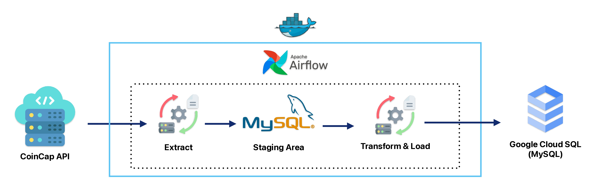

# 🪙 CoinCap Pipeline

> ETL modular em Python com Airflow, SQLAlchemy, MySQL, PostgreSQL e Docker Compose.

Este projeto tem como objetivo realizar a extração, transformação, carga e vizualicação via PowerBI de dados de criptomoedas usando a API [CoinCap](https://docs.coincap.io/). O pipeline é dividido em três etapas principais:

- **Extract**: coleta os dados da API CoinCap.
- **Load Staging**: armazena os dados brutos em uma tabela de staging no MySQL.
- **Transform and Load Final**: transforma os dados e carrega em tabelas finais (dimensional e de fatos) no Google Cloud SQL.
- **Dashboard interativo no Power BI**: dashboard interativo facilitando insights em tempo real sobre o mercado de criptoativos. (Também foi feito um Dashboard usando LookerStudio que é uma versão online e grátis para publicação, acesse [aqui](https://lookerstudio.google.com/reporting/c3937528-a5da-40da-865b-84251862ee88/page/d22IF)).

---

## 🔁 Fluxograma da Solução

Abaixo está o fluxo completo do processo de ETL:



---

## 🧱 Estrutura do Projeto

```
crypto-data-pipeline/
├── dags/
│   └── dag_etl.py              # DAG principal do Airflow
├── .devcontainer/
│   └── devcontainer.json
│   └── docker-compose.yml 
│   └── Dockerfile   
├── include/                        # Módulos compartilhados
│   ├── config/
│   │   ├── config.py                # Configurações gerais
│   │   └── logging_config.py       # Configuração de logs
│   │
│   ├── database/
│   │   ├── db_connection.py           # Conexões com bancos
│   │   └── create_tables.py           # Arquivo para criação das tabelas
│   │
│   └── etl/
│       ├── extract.py
│       ├── transform.py
│       └── load.py
│       └── run_etl_manual.py         # Arquivo para rodar manualmente o processo ETL
│   
├── powerbi/
│   └── crypto-currency.pbix          # Power Bi com visualizacação dos dados   
├── .env                       # Variáveis de ambiente do projeto
├── requirements.txt
└── README.md
```

---

## 🚀 Como rodar o projeto localmente

### 1. Clone o repositório

```bash
git clone https://github.com/LucasEloi13/coincap_pipeline.git
cd coincap_pipeline
```

### 2. Configure as variáveis de ambiente

Antes de rodar o projeto, é necessário configurar o arquivo `.env` com as credenciais e parâmetros corretos de API e banco de dados. Um exemplo está disponível no arquivo `example.env`.

### Como usar:
1. Copie o arquivo de exemplo:
   ```bash
   cp example.env .env
   ```
2. Edite o novo arquivo EXAMPLE.env com suas configurações reais:
- Sua chave da API CoinCap
- Acesso ao banco de dados MySQL (Staging)
- Acesso ao banco de dados Cloud SQL (Data Warehouse)

### 3. Rode o projeto com Docker Compose

```bash
docker-compose up --build
```

A interface do Airflow estará acessível em: [http://localhost:8080](http://localhost:8080)  

### 4. Teste as conexões

Para testar as conexões com os bancos de dados, execute dentro da pasta raiz do projeto:

```bash
PYTHONPATH=. python include/test/test_connection.py
```

### 5. Rodando manualmente

Por fim, para testar a pipeline etl antes de rodar com Airflow, ou para fazer outros testes mauais, use esse executável python manual:
```bash
PYTHONPATH=. python include/etl/run_etl_manual.py
```

---

## 📊 Tabelas criadas

### Staging (MySQL)

- `crypto_raw`: recebe os dados brutos da API CoinCap

### Data Warehouse (PostgreSQL)

- `cryptocurrencies`: tabela dimensional com informações das moedas
- `crypto_market_data`: tabela de fatos com métricas de mercado
- `crypto_powerbi_summary`: visão consolidada para uso no Power BI

### 🛠️ Criação das Tabelas
Para criar todas as tabelas necessárias no ambiente de staging e data warehouse, execute o seguinte comando no terminal:

```
python include/database/create_tables.py
```

---

## 📌 Requisitos

- Python 3.10+
- Docker + Docker Compose
- [CoinCap API](https://docs.coincap.io/)

Instale os pacotes:

```bash
pip install -r requirements.txt
```

---

## 🧠 Tecnologias Utilizadas

- Python
- Airflow
- Docker & Docker Compose
- SQLAlchemy
- MySQL
- Google Cloud Plataform
- PostgreSQL
- CoinCap API
- Power BI (consumindo dados via `crypto_powerbi_summary`)

---

## 📷 Visualização do Dashboard

Caso queira acessar um Dashboard feito no lookerStudio (versão free que permite publicação), acesse [aqui](https://lookerstudio.google.com/reporting/c3937528-a5da-40da-865b-84251862ee88/page/d22IF).


## ✍️ Autor

Desenvolvido por [Lucas Eloi]([https://github.com/LucasEloi13](https://www.linkedin.com/in/lucaseloi1/))
