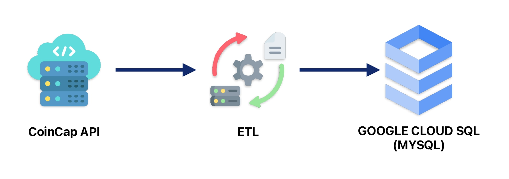
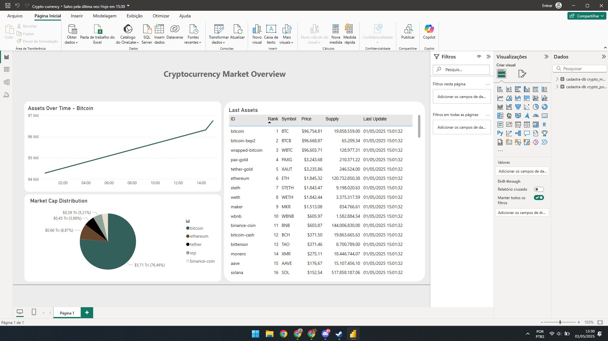

# 📊 Projeto de Pipeline para Análise de Criptomoedas

Este projeto tem como objetivo coletar, transformar e analisar dados de criptomoedas utilizando a API da CoinCap, Google Cloud SQL e Power BI. A arquitetura está baseada em uma pipeline ETL construída em Python.

---

## 📁 Estrutura do Projeto

```
├── EXAMPLE.env                         # Exemplo de configuração de ambiente
├── README.md                          # Documentação do projeto
├── images
│   ├── dashboard-print.png            # Print do dashboard no Power BI
│   └── fluxo.jpg                      # Fluxograma da pipeline
├── pipeline
│   ├── DAGS                           # DAGs para orquestração (ainda não implementado)
│   ├── logs
│   │   └── pipeline.log               # Logs da execução
│   └── src
│       ├── config.py                  # Configurações e variáveis de ambiente
│       ├── db.py                      # Conexão e manipulação do banco
│       ├── etl.py                     # Funções de extração, transformação e carga
│       └── run.py                     # Script principal de execução
├── powerbi
│   └── Crypto-currency.pbix          # Arquivo do dashboard Power BI
└── requirements.txt                   # Dependências do projeto
```

---

## 🔁 Fluxograma da Solução

Abaixo está o fluxo completo do processo de ETL:



---

## 🧠 Resumo do Projeto

O projeto automatiza o processo de coleta de dados de criptomoedas utilizando a **API CoinCap**. Os dados passam por uma etapa de transformação e são armazenados no **Google Cloud SQL**. A partir daí, os dados podem ser analisados por meio de um **dashboard interativo no Power BI**, facilitando insights em tempo real sobre o mercado de criptoativos.

---

## 🚀 Como Executar o Projeto

### 1. Clonar o repositório
```bash
git https://github.com/LucasEloi13/crypto-data-pipeline
cd crypto-data-pipeline
```

### 2. Criar e configurar o arquivo `.env`
Copie o conteúdo de `EXAMPLE.env` para `.env` e preencha com suas:

Preencha os seguintes campos:
- API Key e URL da CoinCap
- Informações do projeto no Google Cloud (ID, região, instância, usuário e senha)

### 3. Criar ambiente virtual e instalar dependências
```bash
python -m venv venv
source venv/bin/activate  # No Windows: venv\Scripts\activate
pip install -r requirements.txt
```

### 4. Executar a pipeline
```bash
python pipeline/src/run.py
```

### 5. Acessar o Power BI
Abra o arquivo `Crypto-currency.pbix` no Power BI Desktop para visualizar e personalizar o dashboard.

---

## 🛠 Tecnologias Utilizadas

- **Python**
- **CoinCap API**
- **Google Cloud SQL**
- **Power BI**
- **SQL**
- **Jupyter Notebook**

---

## 📷 Visualização do Dashboard



---

## ➡️ Próximos Passos

Melhorias planejadas para o projeto:

- **Automatização com Airflow**  
  Criar DAGs para orquestração do pipeline

- **Containerização**  
  Empacotar a solução em containers Docker

- **Deploy na Nuvem**  
  Implementar em VM do GCP com execução agendada


---
## ⚠️ Observações Importantes

1. **Dashboard no Power BI**  
   - O arquivo `Crypto-currency.pbix` está disponível na pasta `/powerbi`  
   - *Não foi possível publicar online* devido à necessidade de licença Premium  

2. **Fluxo de Dados Simplificado**  
   - Não foi utilizada staging area porque:  
     ✅ Os dados da API já vêm relativamente tratados  
     ✅ Volume pequeno de informações (não sobrecarrega o banco)  
     ✅ Transformações necessárias são mínimas 

3. **Escalabilidade**  
   - A arquitetura atual é ideal para volumes pequenos de dados  
   - Para grandes volumes, recomenda-se:  
     - Implementar staging tables  
     - Adicionar tratamento de erros robusto  
     - Considerar processamento em lotes  
